# RFZ-CLI User Flow Diagrams

> Mermaid diagrams for pitch presentation
> Version: 1.0.0

---

## 1. Overview: Main Navigation Flow

```mermaid
flowchart TB
    subgraph entry["🚀 Entry"]
        START([Launch App]) --> WELCOME[Welcome Screen]
    end

    subgraph nav["📍 Main Navigation"]
        WELCOME --> NAV{Navigation Panel}
        NAV -->|"1"| BUILD[Build Components]
        NAV -->|"2"| LOGS[Log Viewer]
        NAV -->|"3"| DISCOVER[Discover]
        NAV -->|"4"| CONFIG[Configuration]
        NAV -->|"q"| EXIT([Exit App])
    end

    subgraph build_flow["🔨 Build Flow"]
        BUILD --> SELECT[Select Components]
        SELECT -->|"Enter"| MODAL[Build Config Modal]
        MODAL -->|"Start Build"| EXEC[Build Execution]
        EXEC -->|"Complete"| RESULT{Result}
        RESULT -->|"Success"| LOGS
        RESULT -->|"Failed"| RETRY[Rebuild Failed]
        RETRY --> EXEC
    end

    subgraph monitoring["📊 Monitoring"]
        LOGS --> FILTER[Filter & Search]
        LOGS --> FOLLOW[Follow Mode]
        EXEC -->|"L"| LOG_MODAL[Logs Modal]
        LOG_MODAL -->|"Esc"| EXEC
    end

    subgraph discovery["🔍 Discovery"]
        DISCOVER --> SCAN[Scan Repositories]
        SCAN --> STATUS[View Status]
        STATUS --> ACTIONS[Git Actions]
    end

    subgraph settings["⚙️ Settings"]
        CONFIG --> PATHS[Scan Paths]
        CONFIG --> REGISTRY[Component Registry]
        CONFIG --> DETECTED[Detected Components]
    end

    %% Cross-navigation
    BUILD -.->|"Esc"| NAV
    LOGS -.->|"Esc"| NAV
    DISCOVER -.->|"Esc"| NAV
    CONFIG -.->|"Esc"| NAV

    style WELCOME fill:#1e40af,color:#fff
    style BUILD fill:#059669,color:#fff
    style LOGS fill:#7c3aed,color:#fff
    style DISCOVER fill:#d97706,color:#fff
    style CONFIG fill:#dc2626,color:#fff
    style EXEC fill:#0891b2,color:#fff
```

---

## 2. Detailed: Build Workflow

---

## 3. Detailed: Log Viewer Flow

---

## 4. Detailed: Discover Flow

```mermaid
flowchart TB
    subgraph scan["Repository Scanning"]
        D_START([Enter Discover]) --> D_SCAN[Scan Configured Paths]
        D_SCAN --> D_FIND[Find RFZ Components]
        D_FIND --> D_GIT[Check Git Status]
        D_GIT --> D_LIST[Component List]
    end

    subgraph display["Component Display"]
        D_LIST --> D_INFO{Component Info}
        D_INFO --> I_NAME[Component Name]
        D_INFO --> I_CAT[Category Badge]
        D_INFO --> I_BRANCH[Git Branch]
        D_INFO --> I_STATUS[Git Status]
        D_INFO --> I_COMMIT[Last Commit]

        I_STATUS --> S_CLEAN[🟢 Clean]
        I_STATUS --> S_DIRTY[🟡 Dirty]
        I_STATUS --> S_UNKNOWN[⚪ Unknown]
    end

    subgraph navigation["Navigation"]
        D_LIST --> D_NAV{Navigate}
        D_NAV -->|"↑/k"| D_PREV[Previous Component]
        D_NAV -->|"↓/j"| D_NEXT[Next Component]
        D_PREV --> D_LIST
        D_NEXT --> D_LIST
    end

    subgraph actions["Git Actions"]
        D_LIST -->|"Tab"| D_ACTIONS[Actions Panel]
        D_ACTIONS --> A_CLONE[Clone Repository]
        D_ACTIONS --> A_CHECKOUT[Checkout Branch]
        D_ACTIONS --> A_STATUS[Refresh Status]
        D_ACTIONS --> A_PULL[Pull Updates]
    end

    subgraph summary["Summary Stats"]
        D_LIST --> D_STATS[Statistics Bar]
        D_STATS --> ST_TOTAL[Total: N]
        D_STATS --> ST_CLEAN[Clean: N]
        D_STATS --> ST_DIRTY[Dirty: N]
        D_STATS --> ST_DEV[Not on develop: N]
    end

    style D_START fill:#d97706,color:#fff
    style S_CLEAN fill:#22c55e,color:#fff
    style S_DIRTY fill:#eab308,color:#000
    style S_UNKNOWN fill:#6b7280,color:#fff
```

---

## 5. Detailed: Configuration Flow

```mermaid
flowchart TB
    subgraph entry["Configuration Screen"]
        C_START([Enter Config]) --> C_SECTIONS{Section Tabs}
        C_SECTIONS -->|"Tab 1"| S_SCAN[Scan Configuration]
        C_SECTIONS -->|"Tab 2"| S_REG[Component Registry]
        C_SECTIONS -->|"Tab 3"| S_DET[Detected Components]
    end

    subgraph scan_config["Scan Configuration (Editable)"]
        S_SCAN --> SC_PATHS[Scan Paths List]
        SC_PATHS --> P_ADD[Add Path]
        SC_PATHS --> P_REMOVE[Remove Path]
        SC_PATHS --> P_TOGGLE[Toggle Enabled]
        SC_PATHS --> P_EDIT[Edit Path Value]

        S_SCAN --> SC_BEHAVIOR[Scan Behavior]
        SC_BEHAVIOR --> B_RECURSIVE[Recursive: On/Off]
        SC_BEHAVIOR --> B_DEPTH[Max Depth: 1-10]
        SC_BEHAVIOR --> B_EXCLUDE[Exclude Patterns]
    end

    subgraph registry["Component Registry (Read-Only)"]
        S_REG --> R_LIST[Registered Components]
        R_LIST --> R_DETAIL{Component Details}
        R_DETAIL --> RD_NAME[Name & Artifact ID]
        R_DETAIL --> RD_CAT[Category]
        R_DETAIL --> RD_PROF[Default Profiles]
        R_DETAIL --> RD_PORT[Supported Ports]
        R_DETAIL --> RD_ORDER[Build Order]
    end

    subgraph detected["Detected Components (Read-Only)"]
        S_DET --> D_LIST[Detection Results]
        D_LIST --> D_ITEM{Component Status}
        D_ITEM --> DI_FOUND[✓ Found + Path]
        D_ITEM --> DI_NOTFOUND[✗ Not Found]
        D_ITEM --> DI_CONFIG[Has Config Module]
    end

    subgraph navigation["Navigation"]
        C_SECTIONS --> N_TAB[Tab: Switch Sections]
        SC_PATHS --> N_ARROWS[↑↓: Navigate Items]
        R_LIST --> N_ARROWS
        D_LIST --> N_ARROWS
        N_ARROWS --> N_ENTER[Enter: Edit/View]
        N_ENTER --> N_ESC[Esc: Back]
    end

    style C_START fill:#dc2626,color:#fff
    style S_SCAN fill:#059669,color:#fff
    style S_REG fill:#6b7280,color:#fff
    style S_DET fill:#6b7280,color:#fff
```

---

## 6. State Machine: Application States

---

## 7. Component Architecture Overview

---

## Usage Notes

### Rendering
These diagrams are written in Mermaid syntax and can be rendered in:
- GitHub README/Markdown files
- VS Code with Mermaid extension
- [Mermaid Live Editor](https://mermaid.live)
- Notion, Confluence, and other documentation tools
- Presentation tools that support Mermaid

### Color Legend
| Color | Meaning |
|-------|---------|
| 🟦 Blue (#1e40af) | Entry/Welcome |
| 🟩 Green (#059669) | Build/Success |
| 🟣 Purple (#7c3aed) | Logs/Monitoring |
| 🟧 Orange (#d97706) | Discover |
| 🟥 Red (#dc2626) | Config/Errors |
| 🔵 Cyan (#0891b2) | Execution/Active |

### Keyboard Shortcuts Reference
| Key | Action |
|-----|--------|
| `1-4` | Navigate to screen |
| `↑↓` / `jk` | Navigate list |
| `Enter` | Select/Confirm |
| `Space` | Toggle |
| `Tab` | Switch focus |
| `Esc` | Back/Cancel |
| `a` | Select all |
| `n` | Select none |
| `L` | View logs |
| `f` | Cycle filter |
| `q` | Quit |
